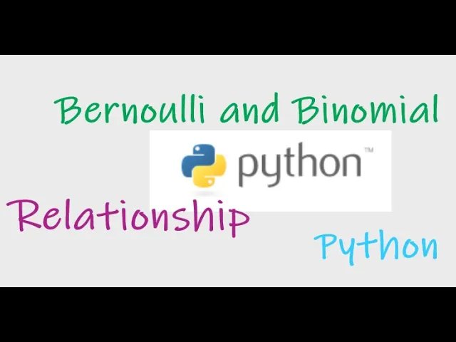
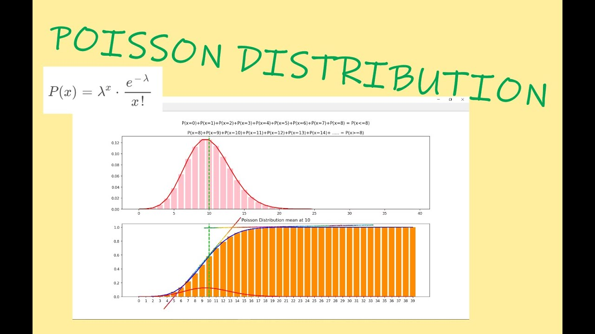
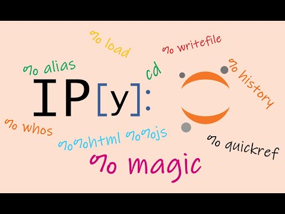

# YouTube

#### [YouTube Link](https://www.youtube.com/channel/UCBh0xDnTdouixDBmVVzRl1g)

Welcome to my **Youtube** channel.
<br><br>
Currently I have three videos related to **Stats** and **Magic functions in ipython**.




### [Bernoulli and Binomial Distribution Link](https://youtu.be/e-n4xQaX_gA)
---


### [Poisson Distribution  Link](https://youtu.be/Q6w7W8zUnGk)

File `poisson.py` contains code for animation of **Poisson distribution.**

### In Terminal : 
```bash
python3 poisson.py dmg # animation for different poisson mean graphs

and

python3 poisson.py pac # animation for probability mass function and cummulative density function 
```
--- 


### [Magic functions, ipython link](https://youtu.be/Mc7Vax4VWgg)


